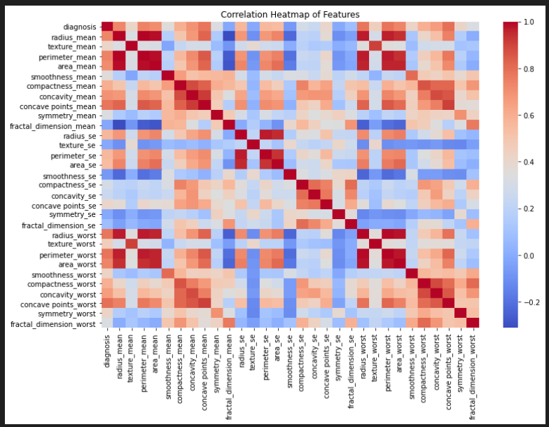
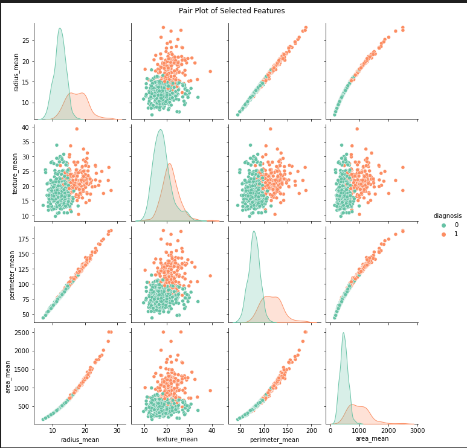
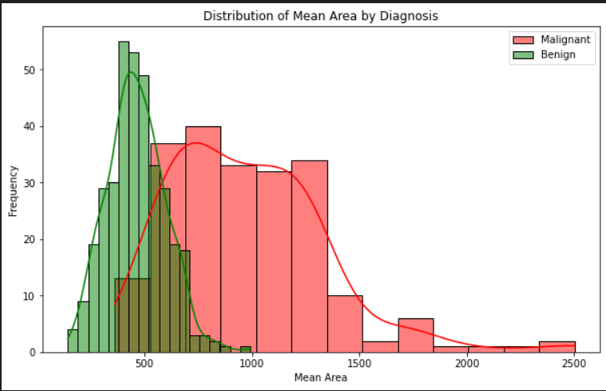
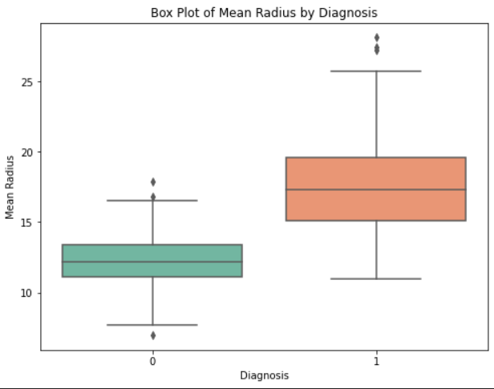

# **Breast Cancer Prediction Using Machine Learning**

## Project Overview

This project follows the CRISP-DM (Cross-Industry Standard Process for Data Mining) methodology to develop a machine learning model for predicting whether a breast tumor is benign or malignant. The objective is to create a reliable and interpretable model to assist healthcare providers in early diagnosis and treatment planning for breast cancer.

## 1. Business Understanding

The goal of this project is to predict the likelihood of a breast tumor being malignant or benign based on various diagnostic measurements. This prediction model aims to aid medical professionals in making faster, more accurate diagnoses, potentially improving patient outcomes.

### Objectives:

* Develop a predictive model for breast cancer diagnosis.
* Ensure the model is interpretable for practical use in a medical setting.
* Achieve high accuracy, precision, and recall to minimize false negatives.

## 2. Data Understanding

The dataset used in this project is the Breast Cancer Wisconsin (Diagnostic) Dataset, which contains features computed from digitized images of fine needle aspirate (FNA) of breast masses.

### Key Features:

* Number of Instances: 569
* Number of Features: 31 (plus a target variable: diagnosis)
* Target Variable: Diagnosis (B = Benign, M = Malignant)

## 3. Data Preparation

Data preparation involved the following steps:

* Feature scaling was applied
* The 'id' column was removed as it did not contribute to the predictive modelling.
* the culumn 'unamed32' was dropped as it was an empty column.

## 4. Modeling

Several machine learning models were evaluated, including:

* Logistic Regression
* Decision Tree
* Random Forest
* Gradient Boosting

## 5. Evaluation

Model performance was evaluated using the following metrics:

* Confusion Matrix
* Accuracy
* Precision
* Recall
* F1-Score

**Best Model**:

Logistic Regression was selected due to its high accuracy (98%) and interpretability.

## Visualization

1. Correlation heatmap

2. Pair plot os selected features

3. Distribution of feature values for each diagnosis

4. Box plots of feature values by diagnosis

## Summary

The Logistic Regression model is ready for deployment and can be integrated into healthcare systems for real-time breast cancer prediction. Future work includes building a user-friendly interface for non-technical users.